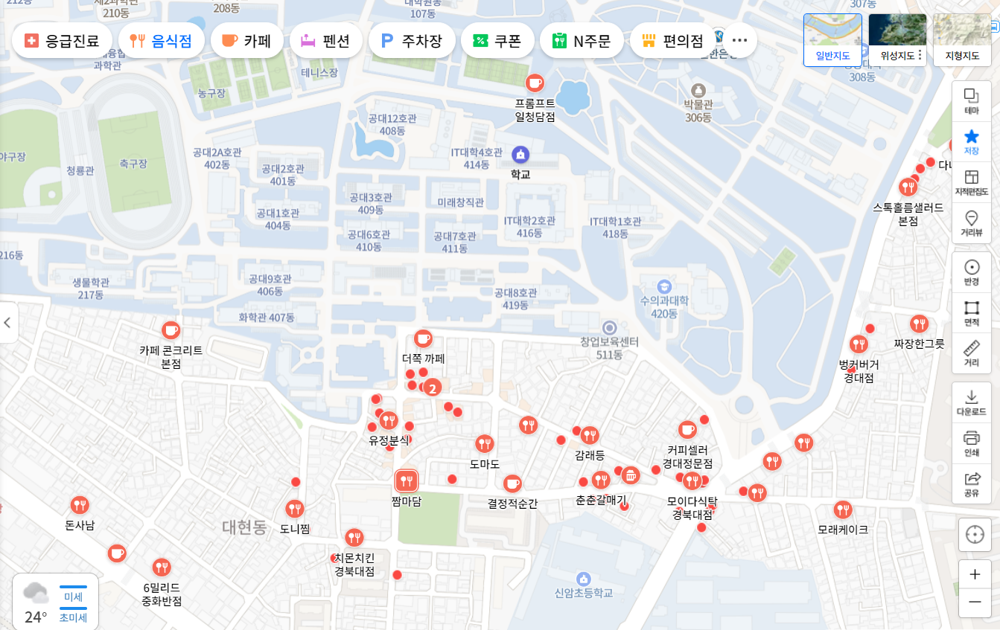
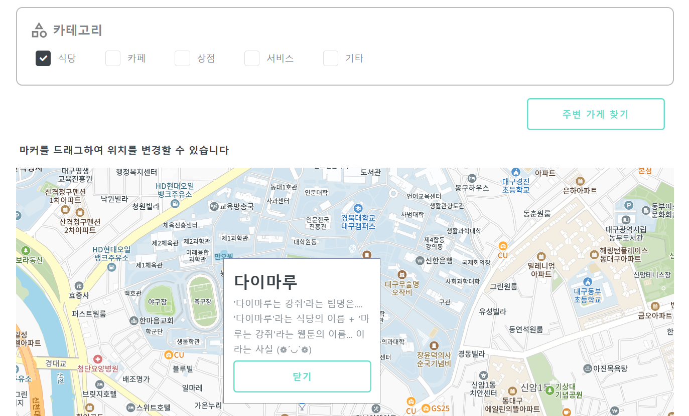
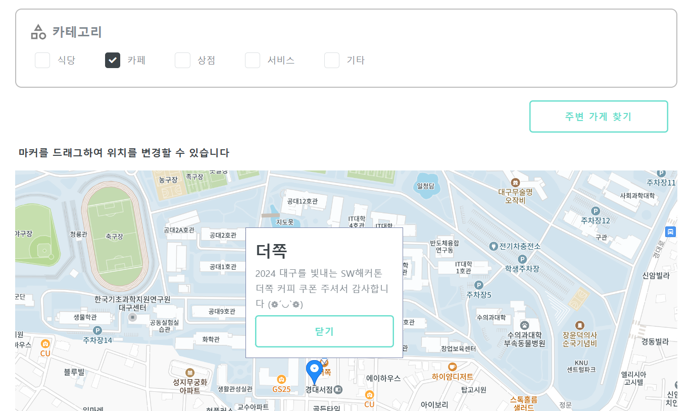

<h1 style="display:inline-block"> 다이마루는 강쥐 - 오하린</h1>

    

## ✨ 서비스 요약
오하린 - 카테고리별로 내 주변 상가의 할인 정보를 한 눈에 조회할 수 있는 서비스

 

## ✅ 주제 구분
-	C타입 대구 지역 상권을 살리는데 도움을 주는 서비스 

 

## 😊 팀원 소개
 다이마루는 강쥐
|||||
|:---:|:---:|:---:|:---:|
|[김은정(컴학23)](https://github.com/eunjeong821)|[노현경(컴학23)](https://github.com/getOffWork102)|[배채은(컴학23)](https://github.com/Chaeeun1117)|[이기준(컴학23)](https://github.com/rlwns1224)|
|프론트엔드|백엔드|백엔드|백엔드|

 

## 📹 시연 영상
(필수) Youtube 링크
(선택) Github Repository 페이지에서 바로 볼 수 있도록 넣어주셔도 좋습니다.

 

## 📌 서비스 소개
### 💡 서비스 개요

  

&nbsp;&nbsp; 오늘의 할인, "오하린"은 주변 오프라인 매장에서 진행 중인 다양한 할인 행사와 이벤트를 음식점, 공방, 의류 매장 등 다양한 카테고리로 구분하여 손쉽게 찾아볼 수 있는 서비스입니다.

&nbsp;&nbsp; 고객들은 가까운 매장의 할인 정보 조회 기능과 맞춤형 추천 정보을, 매장 상인들은 가게 홍보 기회를 편리하게 얻을 수 있습니다.

&nbsp;&nbsp; 이를 통해 소비자와 상인 간의 소통을 강화하고, 지역 경제를 활성화할 수 있습니다.

### 💡 타서비스와의 차별점
|||
|:---:|:---:|
|기존 지도 서비스|오늘의 할인, '오하린'|

기존 지도 서비스와 '오하린'의 가장 큰 차별점은 할인 이벤트와 쿠폰을 제공하는 가게들을 마커로 표시한다는 점입니다. 기존 지도 서비스들은 카테고리를 선택하든 상관없이 사업자 등록이 되어있는 모든 가게를 보여주지만, '오하린'은 사용자들이 할인 혜택을 쉽게 찾을 수 있도록 특정 가게에만 마커를 띄웁니다. 이를 통해 사용자들은 할인 이벤트를 진행 중인 가게를 우선적으로 찾아볼 수 있습니다. 

### 💡 구현 내용 및 결과물
1. 위치 기반 할인 행사 조회
- 현재 위치에서 반경 1~10km 이내의 할인 행사를 실시간으로 확인할 수 있습니다.  
2. 카테고리별 점포 선택
- 음식점, 공방, 의류 매장 등 다양한 카테고리에 점포들의 서 점포를 선택하여 지도에 마커로 표시합니다. 마커를 클릭하면 할인 행사 정보와 오프라인 쿠폰을 발급받을 수 있습니다.  
3. 찜 기능
- 원하는 행사 정보를 저장하여 한 눈에 볼 수 있도록 합니다.  
4. 쿠폰 재사용 방지 기능
- 쿠폰 사용 시 스크린 캡쳐를 방지하기 위해 유효한 페이지 상단에 움직이는 띠를 표시합니다. 재발급 또한 데이터베이스 검색을 통해 막아놓습니다.  
5. 회원가입 및 인증
- OTP 인증을 통해 중복 회원가입을 방지하고, 안전한 가입 절차를 제공합니다.  
6. 가게 등록 간편화
- 점포 위치 검색 기능과 점포명 입력만으로 쉽게 가게를 등록할 수 있습니다.  
7. 회원 관리 기능 제공
- 비밀번호 찾기, 회원 탈퇴 등 사용자 관리 기능을 지원합니다.  

### 💡 구현 방식
- 프론트엔드

HTML, CSS, JavaScript, jQuery
설명: 기본적으로 HTML, CSS, JavaScript를 사용하였으며, CSS의 레이아웃 모듈인 Flexbox와 JavaScript의 라이브러리인 jQuery를 이용하여 반응형 웹페이지를 구현했습니다.

- 백엔드

언어: JavaScript (Node.js)
프레임워크: Express.js
설명: REST API 서버로 Express.js를 사용하였으며, 데이터베이스와의 연결은 Supabase를 통해 처리했습니다. JWT를 사용하여 인증 및 권한 관리를 구현했습니다.

- 데이터베이스

Supabase (PostgreSQL 기반)
설명: Supabase를 이용하여 사용자 및 쿠폰 데이터를 관리했으며, 실시간 데이터 동기화를 활용했습니다.

 

## 💭 향후 개선 혹은 발전 방안
1. 가게 등록시 본인 사업임을 증명할 수 있는 서류들과 본인확인 서류 등을 받아 허가받으면 가게 관리를 할 수 있게 할 예정입니다.
2. 특정 위치 정보를 저장해 북마크 하여 주변 이외 위치도 빠르게 확인할 수 있도록 할 예정입니다.
3. '주변 가게 찾기'를 누르면 마커가 자동 이동하도록 바꿔 편의성을 높일 예정입니다.
3. 마감에 임박한 이벤트가 있는 가게일 수록 가게위치 마커 색을 적색으로 표시할 예정입니다.
4. 마감에 임박한 찜 이벤트가 있을 경우 리마인드 문자 서비스를 제공할 예정입니다.
5. 쿠폰 혹은 찜 이벤트를 눌렀을 경우 종속되어있는 가게를 지도로 보여줄 예정입니다.
6. 문의사항 페이지를 만들어 소통을 더 간편하게 만들 예정입니다.
7. 카테고리를 늘려 사용자가 원하는 정보를 더 명확히 보여줄 예정입니다.
8. 추후 가게와 협업하여 애플리케이선 전용 쿠폰이 보급될 예정입니다.
9. 캘린더를 만들어 원하는 이벤트들을 더 보기좋게 확인할 수 있도록 만들 예정입니다.
10. 가게가 쿠폰과 행사를 관리하기 편하도록 목록화 한 페이지를 추가로 제작할 예정입니다.
